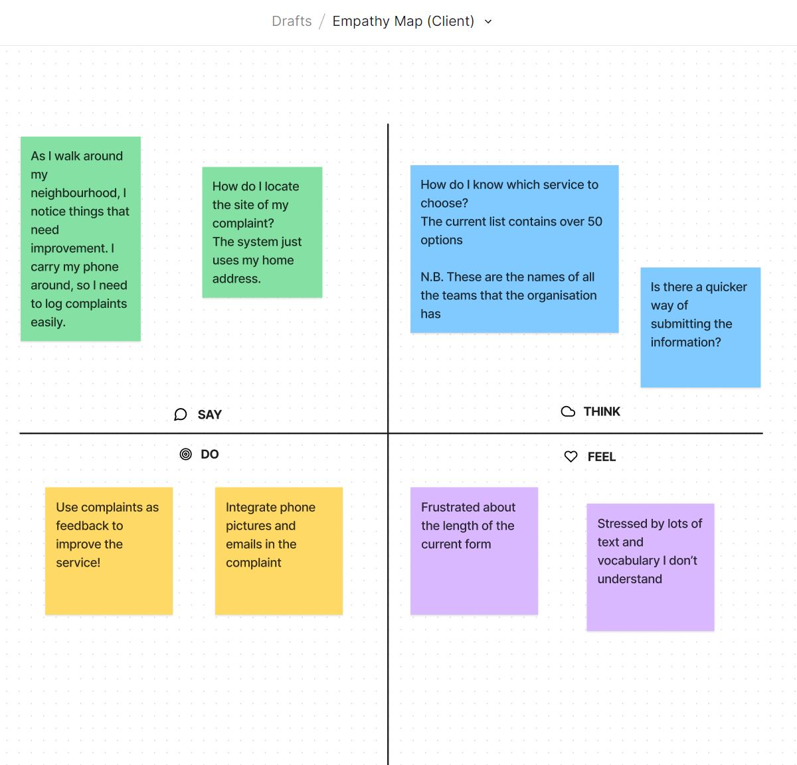
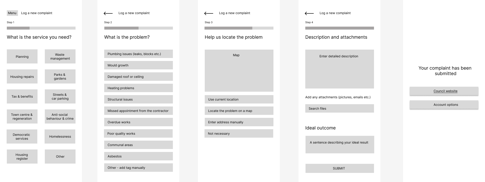
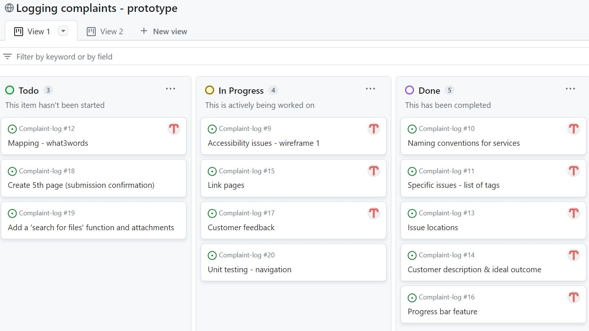
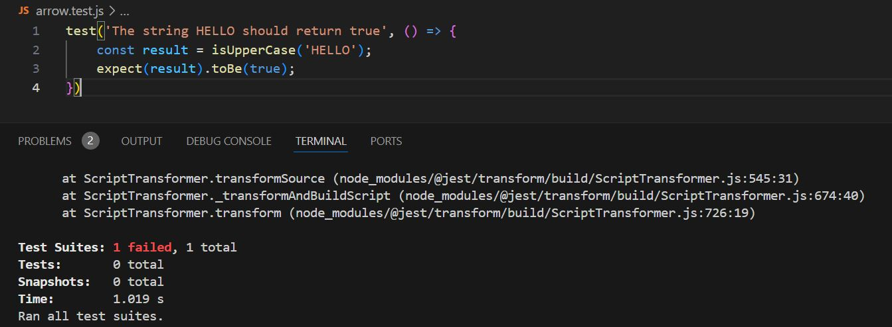

# Logging complaints
The project proposal is to create a form that allows customers to log complaints regarding the services they receive from our organisation. The customers are residents that can choose from a variety of services, such as waste management and housing repairs. Their contact details and requests are already stored into an internal CRM system. However, the current form used for logging complaints is tedious and confusing for the customer and it does not capture the essential information needed for performance analysis; the complaints typically come as large paragraphs of text, which make it difficult to extract the key information required for contract management.  

Therefore, this application proposes to allow the customer to log a complaint quickly and efficiently, whilst allowing our organisation to collect accurate data, which will later be used to inform service improvements.  

## User requirements 

This iteration of the app was developed with the director of the service as main customer. She provided the main user requirements and commented on the wireframe. In terms of channels, she confirmed that most customers use their phone to log complaints, therefore the form needs to be split into small, manageable chunks and the text needs to be kept at a minimum. The app also encourages customers to think about the key issue that is the topic of the complaint, as currently the customer input comes as long paragraphs that contain several issues, most of which have happened in the past, but no longer require our services.  

## Design
 

The picture above shows the proposed low fidelity design of the application. This was prototyped using Figma as a wireframe (low fidelity version of the app). The wireframe consists of five pages - the approach is to gradually take the customer through a series of branched questions that help us get progressively more details about the complaint. 

### User feedback

The feedback for this iteration was discussed during a review meeting with the service director. She confirmed that the form is easy to use (particularly through the use of boxes as selection options).  She also confirmed that this form will plug the data gaps within the internal KPI reporting system, as the service tags and locations will provide more accurate views on where the service needs to make major improvements and investments, in order to reduce the volume of complaints. 

After the first iteration of the app will be completed, the wireframe will be tested with customers. Feedback will be sought [here](https://forms.gle/3sAep24cSECT3Pjr9). Afterwards, a high fidelity version of the app will be developed. 

### Location
[Here](https://it2156.github.io/SUM1/) is the live app. The project is still in development - there are several pages that need to be added and the functionality of some of the buttons on the landing page do not work. 

## Project plan

### Agile project management

Using the Agile methodology requires a different approach to the classical development project. Productivity tools allow managers to improve the project incrementally, through sprints, reviews and retrospectives. It is also important to integrate user requirements, project artifacts and iterative designs. Although the work is collaborative in nature, the software development team consists of multiple members who each have their own workstations - therefore, these personal environments must be managed through a collaborative platform that can merge brainstorming exercises, coding, and test artifacts (Crowder et al, 2014). 

### Applied methodology

Likewise, this project is managed using the Agile project management approach, because it allows the customer to give feedback frequently and see results quickly. Requests and features are added as issues and visualised on a Kanban board, which helps the scrum master keep track of the overall project. The ticketing system holds a list of all the features that are required for the project; each item is created through a specific branch, which is submitted as a pull request.The designated approver reviews this against the project requirements, then the updated item is merged to the main code. For a larger project, a sequence of sprints would need to be created - these could be based on different iterations of the website wireframe, followed by a fully designed version of the website. At the start of the project, the tasks were in the 'To Do' bucket; gradually, these are progressed, therefore the tickets get moved across the board, until they are all in the "Done" section. 

## Code development 

The repository was cloned into a local version for VS Code, which was used to create local files and write the code for one page. Afterwards, the code was pushed from the local machine to GitHub, by setting up local credentials. The change were committed to the repository which creates a pull request. This gives the approver the option to review the changes and comment on the change, approve it or request changes if potentially the updates did not meet the criteria of the ticket. Comminting changes to branches allows other developers to review the code before merging the new features to the main code. 

The html and css pages were generated using Figma's developer mode. The code was copied into VCS and Live Studio was used iteratively to edit the code. 

<<<<<<< HEAD
The html pages were created in order to have the main page containers set. Each html page corresponds to a different section of the complaint form. The html pages contain general sections and divisions (div), which are styled using linked css files. For example, the LandingPage.html was linked to its corresponding css file. A global css file contains the elements that are common to all the app pages. 

The main interactive element is navigation, which happens by clicking the 'back' arrow on the 'Issues' page (second page) or clicking on the 'Planning' box on the first page. The jss files were generated using code from www.shecodes.io  and www.w3schools.com . The links are in the references list. 

The main interactive element is navigation, which happens by clicking on one of the question options.

## Testing

### Accessibility

The first iteration of the app scored high in performance, but low in terms of accessibility. The html pages would need a language element and title, in order to improve. 

This was tested using Lighthouse.

### Unit test

The benefits of unit testing are:
* YFinding and preventing bugs quicker
* Better use of time and resources, as bugs can be fixed immediately
* Reliable and re-usable code
* They can serve as documentation (4Geeks, n.d.). 

For this assignment, I have tried a smokescreen test to begin with, which failed.

## Evaluation

The application has two pages which have been developed; hoverver the rest will have to be added later; some of these will require advanced functionality, such as the ability to search for files and upload them. 

On the Landing Page, only the first button allows the user to interact, by clicking and moving to the next option. Each service option will need its own dedicated page with issue tags; these will have to be collected from each specialist team within the organisation. 

Overall, the app has gathered interest from my department and it will likely be developed further. 

Personally, it has been a steep learning curve; it has given me an overview of the breadth of software packages that are required for full stack development. Each of these requires in-depth knowledge, which, I imagine, takes years to master at a decent level. 

### References 
Crowder, James A., and Shelli Friess, 2014. Agile Project Management : Managing for Success. Springer, https://doi.org/10.1007/978-3-319-09018-4.

4Geeks. (n.d.). How to create unit testing with JEST. [online] Available at: https://4geeks.com/lesson/how-to-create-unit-testing-with-javascript-and-jest#arrow-function [Accessed 26 Apr. 2024].

www.shecodes.io. (n.d.). [React] - How to use addEventListener in React. [online] Available at: https://www.shecodes.io/athena/10111-how-to-use-addeventlistener-in-react [Accessed 26 Apr. 2024].

‌

www.w3schools.com. (n.d.). HTML DOM addEventListener() Method. [online] Available at: https://www.w3schools.com/jsref/met_element_addeventlistener.asp.

‌
